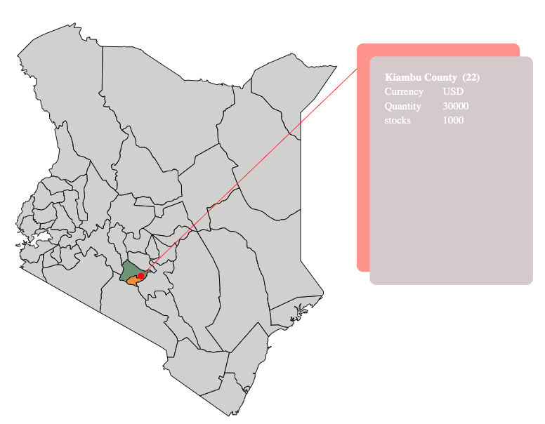
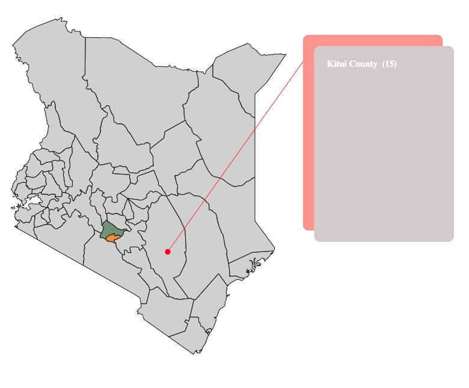

# Angular SVG US Map

This package is used to generate an SVG Map of Kenya and also giving ability to set callback function and some parameters to change fill & stroke color and also custom fields for display of data

## How to install

<pre>npm install kenya-map</pre>

## Configuration

app.module.ts

<pre>import { kenyaMapModule } from 'kenya-map';</pre>

You need to add this module in @NgModule(Imports). That's it.

## Accessing Component

<pre>&lt;kenya-map&gt;&lt;/kenya-map&gt;</pre>

## API Reference

### Inputs

|||
|-|-|
| `fillColor`      | Type: `string` Optional. Will change color of county name text. For Example: `fillColor="#C0C0C0"`  (Not enabled for now)      |
| `fillCountyColor` | Type: `string` Optional. Will change background color of county area. For Example: `fillCountyColor="#C0C0C0"` |
| `strokeColor`    | Type: `string` Optional. Will change border color of county area. For Example: `strokeColor="#C0C0C0"`     |

### Output
|||
|-|-|
| `onMapClick` | Will be emitted when county area has been clicked. It returns `county id and name` { "county": { countyID, countyName } }. (onMapClick) event. |

Moreover, you can apply your own css to beautify this component.
